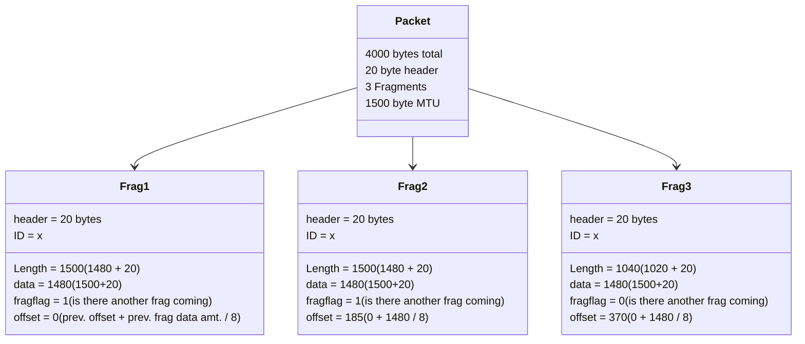

> Go for it now. The future is promised to no one.
>
> - <cite>Wayne Dyer</cite>✍️

# CNT4007 Review !!!!
## Chapter 3
### Homework
1. What are the two key functions of a router at the network layer?
	1. The router builds a "forwarding table", so that it knows where to send packets when it receives them. Also, it handles packet forwarding, which utilizes the aforementioned forwarding table in order to determine each packet's output.
2. Why is packet queueing needed at the output ports of the router?
	1. If the case happens where more packets are received at the input of the router than the output can handle sending (input rate > max output rate), queueing is needed in order to buffer the excess packets.
3. If there is a 4000 byte packet (20 bytes header and 3980 data bytes), that is passing through a link with MTU (max transfer unit, this is just the total amt. of bytes that can pass through at a time) of 1500 bytes, how many fragments will the packet be split into?
	1. 3 Fragments. First two carry 1480 bytes of data, third carries 1020. 1480+1480+1020=3980 bytes + 20 (header bytes) = 4000 bytes

4. If you have a network with one publicly routable address, with 10 devices connected to it, can an external host initiate communication to these devices? 
	1. No. In order to allow this to happen, the NAT entries for the devices must manually be inserted into the NAT table of the router.
5. If you have a datagram network with 32-bit host addresses, and a router with 4 links (0 through 3) and packets are to be forwarded as below:
	1. Provide forwarding table that has five entries, uses longest prefix matching, and forwards packets to the correct link interfaces. 
	2. Describe how your forwarding table determines the appropriate link interface for datagrams with destination addresses:
		1. 11001000 10010001 01010001 01010101 
		2. 11100001 01000000 11000011 00111100 
		3. 11100001 10000000 00010001 01110111

![[Pasted image 20220919102414.png]]
a)
Prefix Match | Link Interface
-------------|---------------
11100000 00 | 0
11100000 01000000 | 1
1110000 | 2
11100001 1 | 3
otherwise | 3

b)
1. This matches prefix 3 (otherwise) as it doesn't match any of the prefixes in the table
2. This matches prefix 2 (1110000) as it is the longest prefix matched from the table
3. This matches prefix 3 (11100001 1) as it is the longest prefix matched from the table

Notes:
- For the first (and longest) prefix you make, choose the range that is longest before the rest of the range becomes ones
	- After this, choose the next longest before the range becomes ones and select everything up to the last one
	- Repeat until the otherwise case
- For otherwise case, find the longest string of like bits and flip the last zero to a one
- Include otherwise as well

6. There is a datagram network with 8-bit (00000000 through 11111111) host addresses. The router uses longest-prefix matching with the below table. For each prefix match, give the range of destination addresses and the number of addresses in the range.

Prefix Match | Interface
-|-
1 | 0
10 | 1
111 | 2
otherwise | 3

Destination Range | Interface | Address Count
-|-|-
110*00000* -> 110*11111* | 0 | 32 (5 "new" bits = 2^5 bits)
10*000000* -> 10*111111* | 1 | 64 (6 "new" bits = 2^6 bits)
111*00000* -> 111*11111* | 2 | 32 (5 "new" bits = 2^5 bits)
0*0000000* -> 1*1111111* | 3 | 32 (5 "new" bits = 2^7 bits)

7. Consider a subnet with prefix 128.119.40.128/26. Give an example of one IP address (of form xxx.xxx.xxx.xxx) that can be assigned to this network. Suppose an ISP owns the block of addresses of the form 128.119.40.64/26. Suppose it wants to create four subnets from this block, with each block having the same number of IP addresses. What are the prefixes (of form a.b.c.d/x) for the four subnets?
	1. Any IP in the range 128.119.40.128 to 128.119.40.191 (64 possible addresses)
		1. The 64 addresses is due to the 26 in the subnet bit number - there are 32 bits (8 + 8 + 8 + 8) total, but 26 of them are for the subnet, so 32-26 = 6. 2^6 = 64, so you can have addresses from the first, up to 128 + 64 in the subnet. 
	2. 

### Lecture Notes