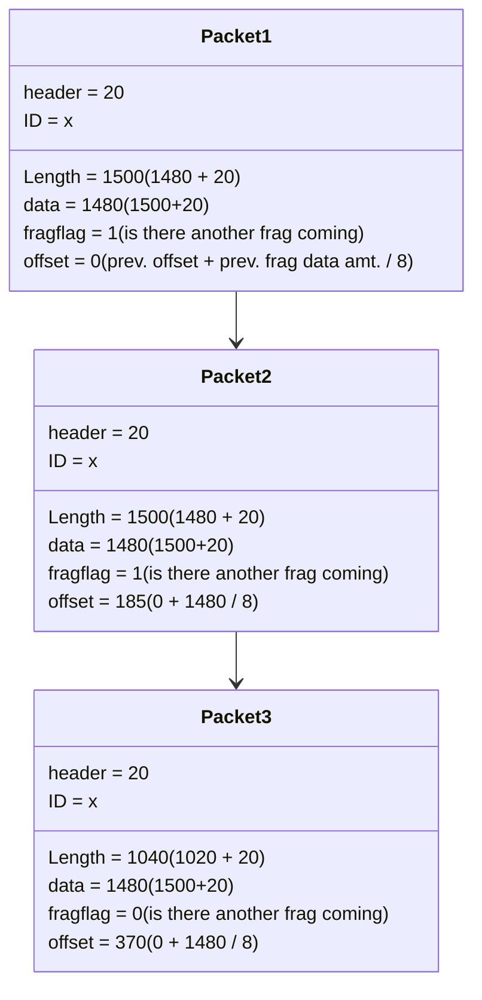

> Go for it now. The future is promised to no one.
>
> - <cite>Wayne Dyer</cite>✍️

# CNT4007 Review !!!!
1. What are the two key functions of a router at the network layer?
	1. The router builds a "forwarding table", so that it knows where to send packets when it receives them. Also, it handles packet forwarding, which utilizes the aforementioned forwarding table in order to determine each packet's output.
2. Why is packet queueing needed at the output ports of the router?
	1. If the case happens where more packets are received at the input of the router than the output can handle sending (input rate > max output rate), queueing is needed in order to buffer the excess packets.
3. If there is a 4000 byte packet (20 bytes header and 3980 data bytes), that is passing through a link with MTU (max transfer unit, this is just the total amt. of bytes that can pass through at a time) of 1500 bytes, how many fragments will the packet be split into?
	1. 3 Fragments. First two carry 1480 bytes of data, third carries 1020. 1480+1480+1020=3980 bytes + 20 (header bytes) = 4000 bytes
