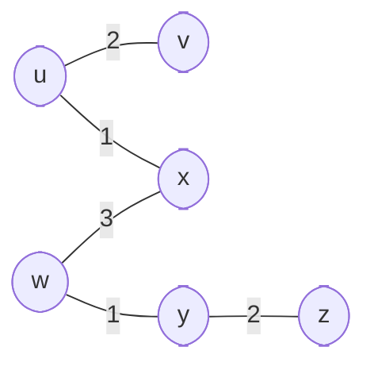

> Go for it now. The future is promised to no one.
>
> - <cite>Wayne Dyer</cite>✍️

# CNT4007 Review !!!!
## Chapters 3 and 4
### Homework
1. What are the two key functions of a router at the network layer?
	1. The router builds a "forwarding table", so that it knows where to send packets when it receives them. Also, it handles packet forwarding, which utilizes the aforementioned forwarding table in order to determine each packet's output.
2. Why is packet queueing needed at the output ports of the router?
	1. If the case happens where more packets are received at the input of the router than the output can handle sending (input rate > max output rate), queueing is needed in order to buffer the excess packets.
3. If there is a 4000 byte packet (20 bytes header and 3980 data bytes), that is passing through a link with MTU (max transfer unit, this is just the total amt. of bytes that can pass through at a time) of 1500 bytes, how many fragments will the packet be split into?
	1. 3 Fragments. First two carry 1480 bytes of data, third carries 1020. 1480+1480+1020=3980 bytes + 20 (header bytes) = 4000 bytes

4. If you have a network with one publicly routable address, with 10 devices connected to it, can an external host initiate communication to these devices? 
	1. No. In order to allow this to happen, the NAT entries for the devices must manually be inserted into the NAT table of the router.
5. If you have a datagram network with 32-bit host addresses, and a router with 4 links (0 through 3) and packets are to be forwarded as below:
	1. Provide forwarding table that has five entries, uses longest prefix matching, and forwards packets to the correct link interfaces. 
	2. Describe how your forwarding table determines the appropriate link interface for datagrams with destination addresses:
		1. 11001000 10010001 01010001 01010101 
		2. 11100001 01000000 11000011 00111100 
		3. 11100001 10000000 00010001 01110111

![[Pasted image 20220919102414.png]]
a)
Prefix Match | Link Interface
-------------|---------------
11100000 00 | 0
11100000 01000000 | 1
1110000 | 2
11100001 1 | 3
otherwise | 3

b)
1. This matches prefix 3 (otherwise) as it doesn't match any of the prefixes in the table
2. This matches prefix 2 (1110000) as it is the longest prefix matched from the table
3. This matches prefix 3 (11100001 1) as it is the longest prefix matched from the table

Notes:
- For the first (and longest) prefix you make, choose the range that is longest before the rest of the range becomes ones
	- After this, choose the next longest before the range becomes ones and select everything up to the last one
	- Repeat until the otherwise case
- For otherwise case, find the longest string of like bits and flip the last zero to a one
- Include otherwise as well

6. There is a datagram network with 8-bit (00000000 through 11111111) host addresses. The router uses longest-prefix matching with the below table. For each prefix match, give the range of destination addresses and the number of addresses in the range.

Prefix Match | Interface
-|-
1 | 0
10 | 1
111 | 2
otherwise | 3

Destination Range | Interface | Address Count
-|-|-
110*00000* -> 110*11111* | 0 | 32 (5 "new" bits = 2^5 bits)
10*000000* -> 10*111111* | 1 | 64 (6 "new" bits = 2^6 bits)
111*00000* -> 111*11111* | 2 | 32 (5 "new" bits = 2^5 bits)
0*0000000* -> 1*1111111* | 3 | 32 (5 "new" bits = 2^7 bits)

7. Consider a subnet with prefix 128.119.40.128/26. Give an example of one IP address (of form xxx.xxx.xxx.xxx) that can be assigned to this network. Suppose an ISP owns the block of addresses of the form 128.119.40.64/26. Suppose it wants to create four subnets from this block, with each block having the same number of IP addresses. What are the prefixes (of form a.b.c.d/x) for the four subnets?
	1. Any IP in the range 128.119.40.128 to 128.119.40.191 (64 possible addresses)
		1. The 64 addresses is due to the 26 in the subnet bit number - there are 32 bits (8 + 8 + 8 + 8) total, but 26 of them are for the subnet, so 32-26 = 6. 2^6 = 64, so you can have addresses from the first, up to 128 + 64 in the subnet. 
	2. The subnets would be 128.119.40.64/28, 128.119.40.80/28, 128.119.40.96/28, 128.119.40.112/28
		1. This is same as above - 128.119.40.64/26 gives an upper limit on addresses to be 128.119.40.128, so each block gets 16 addresses, so the subnet bits becomes 28 (32-28=4, 2^4=16)

### Lecture Notes
- Router Switching
	- This describes transferring the packet from input to the correct output port
	- *Switching Rate* - rate at which packets can be transferred from input to output, measured as a multiple of input/output line rate
	- 3 different methods: memory, bus, and crossbar
	- Memory Switching
		- First generation routers used this, they were computers with switching that was under direct control of the CPU
		- Involved copying the packet into system memory and then copying back to the output port
		- Speed was limited by memory bandwidth, because there were 2 bus crossings per packet
	- Bus Switching
		- Packet sent from input port memory to output port memory via shared bus
		- Switching speed is limited by bus bandwidth
	- Crossbar Switching
		- Overcame the bandwidth limitations in place with bus switching
- DHCP - Dynamic Host Configuration Protocol
	- Allows host devices to be given an IP address when they are connected to the network, and only when they are connected - this allows reuse of IP addresses, and support for devices that connect more temporarily (mobile devices)
	- Can deliver address of first-hop router for client, name and IP of DNS server, and network mask (allows delineation between host and network addresses)
- TCP - Transmission Control Protocol
- UDP - User Datagram Protocol
- NAT - Network Address Translation
	- Since a local network sends all data from the same address, NAT is needed to translate incoming and outgoing traffic addresses so they get where they need to be
Host | Destination
-|-
10.0.0.1, 3345 | 128.119.40.186
Translated to 138.76.29.7, 5001 | 128.119.40.186
Reply | Original Host
128.119.40.186 | 138.76.29.7, 5001
128.119.40.186 | Translated back to 10.0.0.1, 3345

NAT Traversal Problem
- If a host wants to connect to a local address, it can't - since these are not accessible from outside of the network
- 3 Solutions:
	- 1. Forward requests made to specific ports on the server to a specific local address
	- 2. UPnP (Universal Plug n Play) automates port map configuration
	- 3. Host and router both connect to a relay outside of the network which bridges packets between destinations
- IPv6
	- Changed header size to 40 bytes, with no fragmentation allowed
	- Removed checksum entirely
	- IPv6 datagrams are carried as payloads in an IPv4 datagram to allow backwards compatibility
		- IPv6 router would connect to x amount of IPv4 routers, which would transmit this "wrapped" IPv6 packet in IPv4, then once it reaches the destination IPv6 router the wrapper would be removed

## Chapter 5
### Homework
1. Describe how a link state routing protocol works. Name a link state routing protocol. Give the pseudo code of the Dijkstra’s algorithm. Based on the network topology below, produce a shortest path tree from the Dijkstra’s algorithm with u being the source node. Construct a forwarding table from the shortest path tree.

a) Link State Routing Protocol
Each router sends its link state, along with the cost of adjacent links, to all other routers. Once it receives link states from the other routes, it uses Dijkstra's algorithm to find the shortest path to any other node, and constructs a forwarding table from this.

b) Dijkstra's algorithm
```
Initialization
Visited = ({u,0})
node u = source
for v in nodes:
	if v adjacent to u:
		Dist(v) = cost(u, v)
		prev(v) = u
	else 
		Dist(v) = inf
		prev(v) = null

Loop
find the next node x not in Visited with shortest Dist
add x to N
update Dist(x) for all adjacent to x and not in N:
	Dist(v) = min(Dist(v), Dist(x)+cost(x, v))
	if Dist(x) + cost(x, v) < Dist(v)
		prev(v) = x
	# new cost to v is either old cost to v or known shortest path cost to x plus cost from x to v
loop until every node is in Visited
```
c) Shortest Path

d) Forwarding Table
Destination | output Link
-|-
v | (u,v)
x | (u,v)
w | (u,x)
y | (u,x)
z | (u,x)

2. Describe how a distance vector routing protocol works. Name a link state routing protocol. Give the pseudo code of the Bellman-Ford algorithm. Suppose a router x has two neighbors, u and v. Suppose cost(x, u) = 1 and cost(x, v) = 5. Update the distance vector at x based on the distance vectors of u and v below.
a) Distance Vector Routing Protocol
A router transmits the cost to each destination to its neighbors. Each router saves the most recent cost to its neighbors. This changes when it receives a different cost from before, or a link goes down.

b) Link State Routing Protocol
One example is OSPF (Open Shortest Path First)

c) Bellman-Ford Code
```
dist(source,dest) = min{cost(source,neighbor 1) + dist(neighbor 1, dest), cost(source,neighbor 2) + dist(neighbor 2, dest), repeat for # neighbors}
```
d) Distance Vector
At u, 
Destination | distance 
-|-
x | 1 
y | 4 
z | 9 
u | 0 
v | 6 
w | 10 
At v, 
Destination | distance 
-|-
x | 5 
y | 14
z | 2
u | 6
v | 0
w | 5
At x,
Destination | distance
-|-
x | 0
y | 5
z | 7
u | 1
v | 5
w | 10

3. How does router 1a learns the existence of X? How does router 2d build its forwarding table that includes both internal address prefixes within its AS and external address prefixes in other ASes?
![[Pasted image 20220919133842.png]]
a) 
3a first learns of X via intra-AS routing protocol. This is advertised to router 2c via eBGP. This is disseminated to 2a via iBGP, and then advertised to 1c via eBGP again. Finally, iBGP is used to get this information from 1c to 1a.

AS : Autonomous system, or "domain" - this is an aggregate region of routers
intra-AS routing : tells one router where all others are in an AS
iBGP : intra Border Gateway Protocol : sends router location from one router to another in an AS
eBGP : extra Border Gateway Protocol : sends router location from one router to another between ASes

b) 
Router 2d builds its local forwarding tables, with entries for internal address prefixes being learned by an intra-AS routing protocol and entries for external address prefixes being learned by BGP.

4. Name one advantage of software-defined networking vs traditional router design.
Easier network management, flexibility in traffic engineering, cheaper or better-performing switches than routers in packet forwarding.

### Lecture Notes
- Traditional Routing Algorithms
	- 
- Software Defined Networking
	- Two network-layer functions: forwarding (data plane), and routing (control plane)
	- There are two approaches to structuring the control plane:
		- Per-router control (traditional)
		- Logically centralized control (Software Defined Networking SD)
- ICMP (Internet Control Message Protocol)
- Network Management