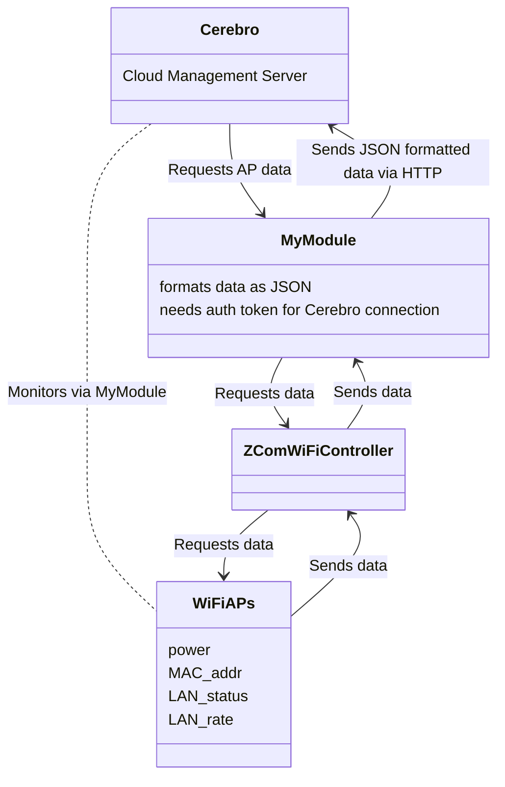

```Quote Here```

# Daily Note
#ZComProject

- Sync with Moon and dev team 9/1
- Monitor data codes actively, and AP statuses
- Email the Data Codes sheet to Moon
- Make changes on Iveda's end to accomodate the format of these statuses if needed
- JSON is preferred as it makes it easier to parse the process, backend is written in Java
- Device I/O API should be able to handle the majority of this stuff
- What we want to achieve may not be provided by this API
- I need access to the device I/O API on Iveda's end in order to hook things up
- If the device doesn't support MQTT we could cross that bridge to use webhooks
- Need to get to the point where we can negotiate with ZCom to ask if they can add functionality that we need
- Do we put it on our team or their team?
- Learn AP Network Topology
- Write out the design logic in a document, topology-wise
- Circle back to Moon on the questions and with the document
- Discover how to map the uplink to the downlink API (?)

Cerebro
_
My module
_ Need to connect module to the WiFi controllers to get info on amount of controllers and their statuses, RESTful is how this would be achieved
Each controller -> many WiFi APs


