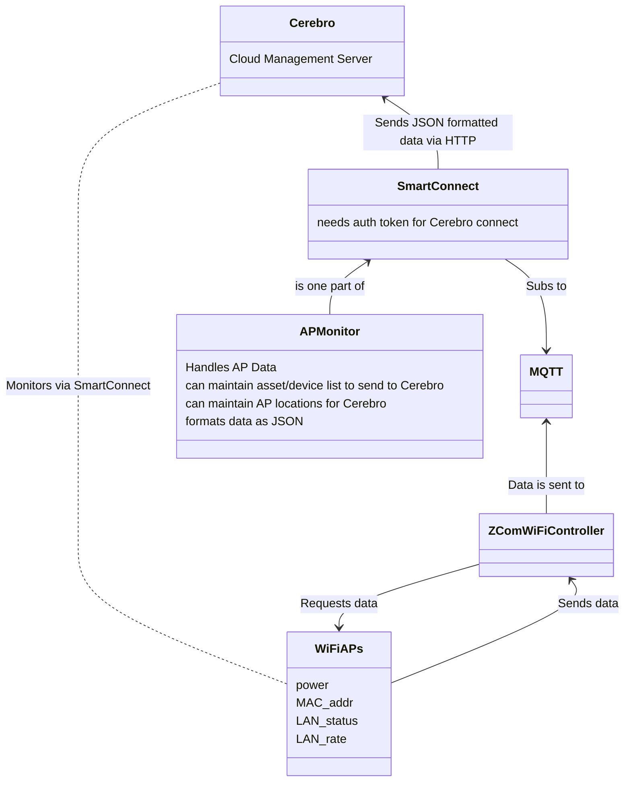
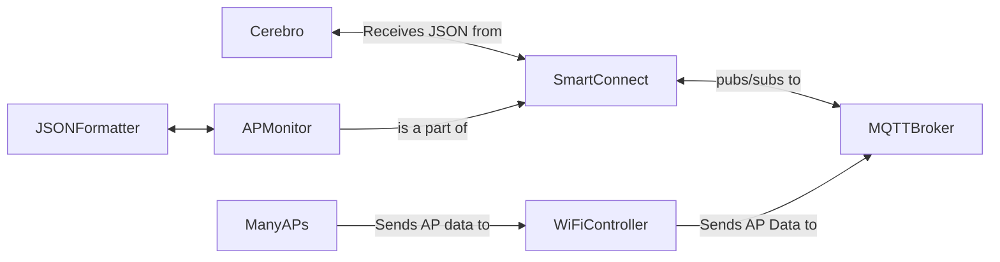

> Well begun is half done.
>
> - <cite>Aristotle</cite>✍️

#ZComProject
- Monitor data codes and AP statuses actively
	- Need to decide on the time interval for this - s, ms?
- #JSON is the preferred file format (my module will be formatting the data from the APs as JSON and sending to Cerebro)
- Backend is written in Java
- Device I/O API should be able to send the majority of the information we need
	- However, what we may want to achieve may not be provided by this API
- If the device doesn't support #MQTT we could cross that bridge to use webhooks
- Need to get to the point where we can negotiate with #ZCom to ask if they can add functionality that we need
	- Do we put the responsibility on our team or their team?
- Reference AP Network Topology
- Write out the design logic in a document, topology-wise

TODO:
- Get deeper into the AP's capabilities - find out how we can get data from it ( #MQTT, #HTTP, proprietary method)

9/12 Flowcharts for network and module (High Level, still in-process planning)

<h1> High Level Network View </h1>

<h1>High Level Module View</h1>

