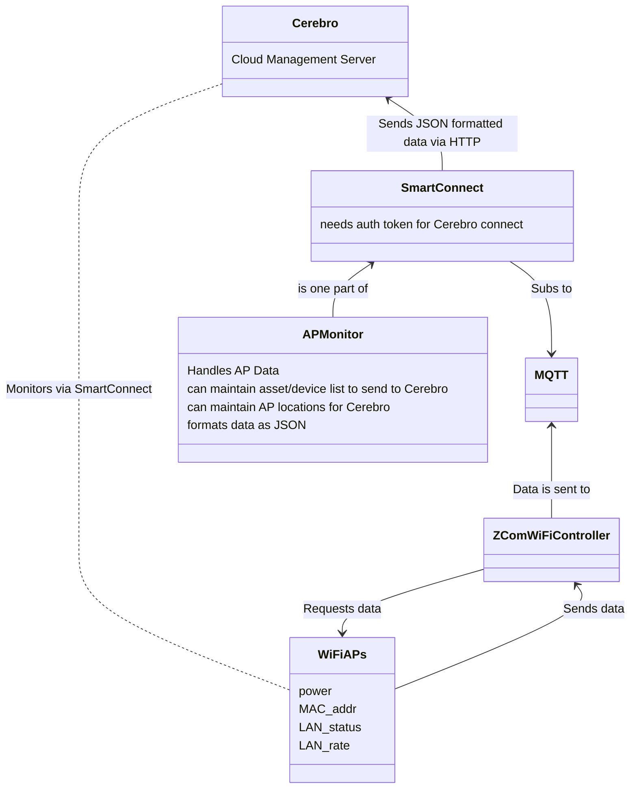
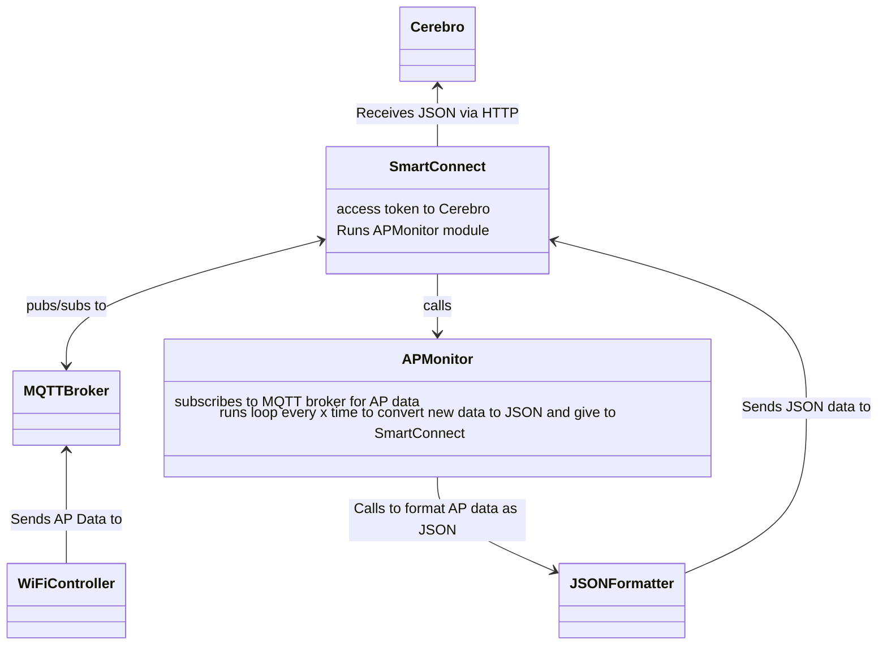

> Well begun is half done.
>
> - <cite>Aristotle</cite>✍️

#ZComProject
- Monitor data codes and AP statuses actively
	- Need to decide on the time interval for this - s, ms?
- #JSON is the preferred file format (my module will be formatting the data from the APs as JSON and sending to Cerebro)
- Backend is written in Java
- Device I/O API should be able to send the majority of the information we need
	- However, what we may want to achieve may not be provided by this API
- If the device doesn't support #MQTT we could cross that bridge to use webhooks
- Need to get to the point where we can negotiate with #ZCom to ask if they can add functionality that we need
	- Do we put the responsibility on our team or their team?
- Reference AP Network Topology
- Write out the design logic in a document, topology-wise

TODO:
- Get deeper into the AP's capabilities - find out how we can get data from it ( #MQTT, #HTTP, proprietary method)

9/12 Flowcharts for network and module (High Level, still in-process planning)

<h1> High Level Network View </h1>

<h1>High Level Module View</h1>

Meeting 10/6 Re: diagrams
- RESTful API layer -> MQTT layer translation needs to be removed, ideally we want ZCom to be able to connect to MQTT on their end
- My application layer
	- need to design it so we can develop an API to hook into ZCOM's RESTful APIs
	- Cloud has MQTT broker in place already, but in other areas we may need a standalone deployment so this requires us to use more resources on site if that needs to happen
	- We have to build something to connect to the ZCOM APs
	- Need to get MOVING
	- Meeting w Dmitry next week
	- Need to be able to answer the whys of the problem
- Dmitry meeting
	- MQTT is the way to go, as it is the standard 
	- AWS makes it easy, lots of documentation
	- Main work will be with getting communication working and implemented with on-site devices
	- We need to find out (re: speak with Sid) how to get a connector with MQTT implemented on ZCom's end.
		- Should be straightforward to implement this
	- Remove the application layer, and have the connector reside on the embedded level
	- We already have a few devices working with our system
		- Smart Pole
	- Get Python scripts implemented in order to test system connections
	- Dmitry will send me the details of getting this done to me
		- Between Dmitry and Lobo, who is an embedded engineer
		- Dev for smart gateway
		- Thread goes over getting that connected to MQTT over AWS
		- Calvin has a script, Dmitry will have him send to me